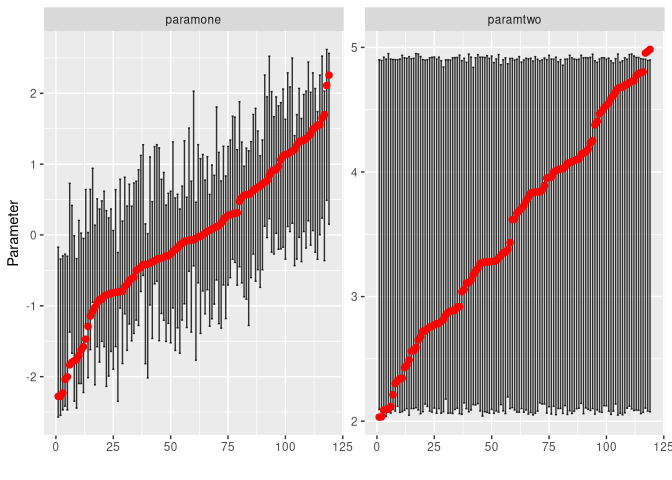
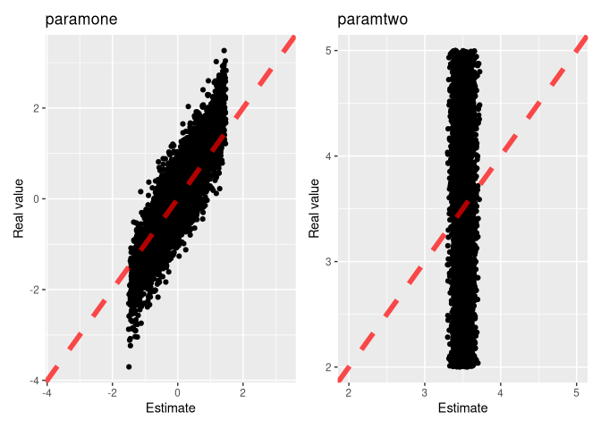

freelunch
================

## An R-package for estimating simulation models

This package provides a common interface for a bunch of
“reference-table” estimation methods to estimate simulation models.

Reference table methods (i.e. run the model a bunch of times at random
then figure out how the real data matches the original parameters) are
very inefficient but they have three big advantages:

    1. They quickly produce *confidence intervals* for estimated parameters
    2. They are **easily testable** by cross-validation
    3. They can all be ranked using the same random samples of input-outputs from the model

## Installation

Install from github with the `devtools` package

``` r
##Might need to uncomment this line on windows/mac
##if you don't build packages from sources:
##Sys.setenv("R_REMOTES_NO_ERRORS_FROM_WARNINGS" = "true")

devtools::install_github("carrknight/freelunch")
```

This package has a lot of dependecies, so the installation will take a
while. Sorry!

## Very quick guide

### Run a model at random

Imagine a simple 2 parameters (`paramone`,`paramtwo`) simulation model
with two summary statistics (`ssone` and `sstwo`). Let’s run it 5,000
times with random inputs:

``` r
set.seed(0)
library(tidyverse)
#> ── Attaching packages ─────────────────────────────────────── tidyverse 1.3.0 ──
#> ✓ ggplot2 3.3.2     ✓ purrr   0.3.4
#> ✓ tibble  3.0.4     ✓ dplyr   1.0.2
#> ✓ tidyr   1.1.2     ✓ stringr 1.4.0
#> ✓ readr   1.4.0     ✓ forcats 0.5.0
#> ── Conflicts ────────────────────────────────────────── tidyverse_conflicts() ──
#> x dplyr::filter() masks stats::filter()
#> x dplyr::lag()    masks stats::lag()

paramone<-rnorm(n=5000)
paramtwo<-runif(n=5000,min=2,max=5)
ssone<-2*paramone + rnorm(n=5000)
sstwo<- paramone/paramtwo  + rnorm(n=5000)
training_data<-
  data.frame(
    paramone,
    paramtwo,
    ssone,
    sstwo
  )
glimpse(training_data)
#> Rows: 5,000
#> Columns: 4
#> $ paramone <dbl> 1.262954285, -0.326233361, 1.329799263, 1.272429321, 0.41464…
#> $ paramtwo <dbl> 3.958031, 2.194137, 4.029837, 4.206115, 2.333899, 2.139964, …
#> $ ssone    <dbl> 3.359710942, 1.218960188, 2.257928728, 1.458035651, 1.009250…
#> $ sstwo    <dbl> 0.62009255, -1.35464108, 1.12005078, 0.22611970, 0.16063519,…
```

Let’s also assume that we have some real data that says that `ssone` is
2 and `sstwo` is 0.25

### Fitting a simulated model

The library `freelunch` comes with a bunch of regression/abc facades
(calling other packages made by better people). In this package the
methods to estimate parameters all start with `fit_*` and they all have
the same interface requiring 4 arguments:

``` r
fit_rejection_abc(training_runs = ...,
                  target_runs =  ...,
                  parameter_colnames =...,
                  summary_statistics_colnames = ...
                  )
fit_loclinear_abc(...)
fit_semiauto_abc(...)
fit_neural_network_abc(...)
fit_linear_regression(...)
fit_gam(...)
fit_quantile_random_forest(...)
fit_random_forest(...)
```

The four parameters needed are just the `training_runs` (data-frame),
the real data observed `target_runs` (can be a vector or a data.frame),
the column names that refer to the parameter `parameter_colnames` and
the column names that refer to `summary_statistics_colnames`.

So let’s just try and fit a classic rejection abc (using the `abc`
package) and we quickly get the estimated parameters as well as bounds
around them:

``` r
library(freelunch)

estimation<-
  fit_rejection_abc(training_runs = training_data,
                  target_runs =  c(2,0.25),
                  parameter_colnames = c("paramone","paramtwo"),
                  summary_statistics_colnames = c("ssone","sstwo")
)

tidy_up_estimation(estimation) %>% knitr::kable()
```

| run | variable |  estimate | higher\_bound | lower\_bound | real |
|----:|:---------|----------:|--------------:|-------------:|-----:|
|   1 | paramone | 0.7413084 |      1.754302 |    -0.199027 |   NA |
|   1 | paramtwo | 3.4300053 |      4.918831 |     2.057512 |   NA |

Looking at these results, you must resist the urge of just looking at
the estimate.  
If you do, which is unfortunately common, you say: `paramone` is 0.74
and `paramtwo` is 3.43.  
Once you look at the confidence intervals you get a better picture:
`paramone` can be recovered somewhat (somewhere between -0.2 and 1.7)
but `paramtwo` bounds are basically anything from 2 to 5 which are
suspiciously similar to the original bounds.

The key here is **never trust estimates without testing**, particularly
point estimates!. Fortunately the package provides cross-validation
helpers for testing.

## Should we trust our fit? Test!

The testing methods in this package all start with `cross_validate_*`
and have the same interface:

``` r
cross_validate_rejection_abc(total_data = ...,
                             parameter_colnames = ...,
                             summary_statistics_colnames = ...
                  )
cross_validate_loclinear_abc(...)
cross_validate_semiauto_abc(...)
cross_validate_neural_network_abc(...)
cross_validate_linear_regression(...)
cross_validate_gam(...)
cross_validate_quantile_random_forest(...)
cross_validate_random_forest(...)
```

What happens here is that we split the runs into some (5 by default)
groups and in turn we pretend not to know the input parameters of one
group (we treat it as “real” data) and then see if the estimation method
is any good.  
The arguments are `total_data` which is just the training data, and the
column names like for `fit_*` calls.

``` r
abc.cv<-
  cross_validate_rejection_abc(total_data = training_data,
                  parameter_colnames = c("paramone","paramtwo"),
                  summary_statistics_colnames = c("ssone","sstwo"),
                  #default parameters:
                  ngroup=5,cv_seed = 0
)
```

If we look at performance<sup id="a1">[1](#f1)</sup> (which goes from 0,
our point predictions are awful, to 1, point predictions are perfect) we
see that we do okay with `paramone` but `paramtwo` predictions are
simply useless:

``` r
abc.cv$performance 
#>      paramone      paramtwo 
#>  0.4969959391 -0.0005872575
```

however, coverage (out-of-sample probability that the real parameter is
in the 95% CI) is quite accurate (target here is 0.95):

``` r
abc.cv$contained 
#> paramone paramtwo 
#>   0.9630   0.9412
```

Summaries however only get you so far, sometimes it’s better to look at
the effect visually

## Plots

Two plot commands can help understand the quality of our estimations and
cross-validation. First, we can look at confidence intervals (black
error bars), how wide they are and how often the real parameter (red
dots) is contained within them.  
Ideally what we want is very small confidence intervals with the red
dots in them about 95% of the times.

``` r
abc.cv %>% plot_confidence_intervals(limit_number_of_runs_to_plot_to = 120)
```

<!-- -->

This plot shows how `paramone` tends to have quite large confidence
intervals but at least they are usually correct; for `paramtwo` the abc
is very wisely deciding NOT to make a real prediction.

And we can also look narrowly at point predictions and see how well they
stack up (best-case scenario all the dots are on the 45 degree line):

``` r
abc.cv %>% plot_point_prediction_quality()
```

<!-- -->

And if the second plot doesn’t convince you that `paramtwo` is **NOT
IDENTIFIED** then nothing else will.

<b id="f1">1</b> Performance is just 1 - (mean square root error of the
estimation)/(mean square root of just using the average) [↩](#a1)
